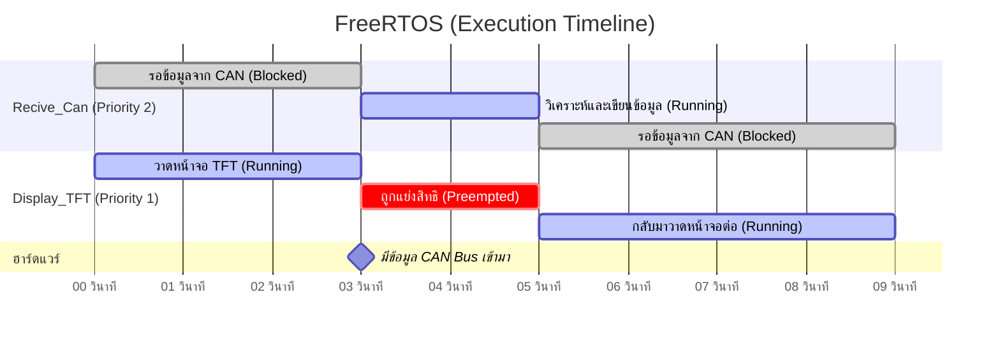

```mermaid
gantt
    title FreeRTOS (Execution Timeline)
    dateFormat  YYYY-MM-DD HH:mm:ss
    axisFormat  %S วินาที
    
    section Recive_Can (Priority 2)
    รอข้อมูลจาก CAN (Blocked)         :done,   c1, 2024-01-01 00:00:00, 3s
    วิเคราะห์และเขียนข้อมูล (Running) :active, c2, after c1, 2s
    รอข้อมูลจาก CAN (Blocked)         :done,   c3, after c2, 4s

    section Display_TFT (Priority 1)
    วาดหน้าจอ TFT (Running)           :active, t1, 2024-01-01 00:00:00, 3s
    ถูกแย่งสิทธิ (Preempted)           :crit,   t2, after t1, 2s
    กลับมาวาดหน้าจอต่อ (Running)       :active, t3, after t2, 4s

    section ฮาร์ดแวร์
    มีข้อมูล CAN Bus เข้ามา            :milestone, m1, 2024-01-01 00:00:03, 0s
``` 